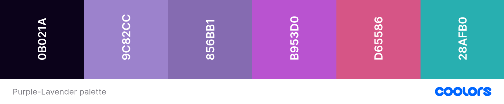

_This is a submission for [Frontend Challenge - December Edition, Glam Up My Markup: Winter Solstice](https://dev.to/challenges/frontend-2024-12-04)_

## What I Built

The website is live here: https://plutonium-239.github.io/dev.to-frontend-challenge/
My goal was to make the given plain HTML more interactive 🤗, beautiful 🎆 and useful 🤖. I did this by _adding consistent styling_ to all the sections, _highlighting important terms_ for grasping content quicker while also _adding more contrast_. I also optimized the site for a mobile layout and while it features less interaction, the site is equally well-themed and useful.

## Demo
The source code is publicly available at https://github.com/plutonium-239/dev.to-frontend-challenge

## Journey

### Theming/CSS
I wanted to go with a night sky theme because the Winter Solstice causes the Northern Hemisphere to experience the shortest day of the year. So, I remembered our old friend `particles.js`. Except now it has transformed into [`tsParticles`](https://github.com/tsparticles/tsparticles) with a bunch of memory leak fixes, optimizations, and a rewrite in typescript. This forms the background of the page. I configured it to not be distracting while also looking lively and aesthetically pleasing. Getting this setup was a pain that I did not expect. The latest version has a `tsparticles.bundle.js` which is supposed to be everything you need and exports globals so that you can get started in one line, but that was not the case. I tried to manually call it's setup while using the `tsparticles.engine.js` to no avail. This suffers from a _lack of useful documentation_. I also tried the `slim` version which had one example usage but it did not work. I tried just replacing the version with an older one (since what I needed was mostly basic behaviour and not their newer features) and struck gold with `1.43.1`. You would expect following the instructions in the readme would get you live, but this was not true here.

Choosing the color scheme was kind of a funny coincidence. I had seen a screenshot of a tumblr post/meme and really liked the colors in it. I literally searched for a [higher res image](https://ifunny.co/picture/ii-macklesufficient-follow-almost-peed-my-pants-today-when-my-SCHIZRVdA) through Google Lens and extracted its colours. This provided me with 3 base colours (surface, primary, active). For the other colours, I wanted one of them to be a red-pink shade and one to be greenish/turquoise. I chose some colors in this range and matched the shade so that it was consistent with the current colour palette. I learnt about great tools like [Colormind](http://colormind.io/) to try alternate colour palettes.

As for typography, I have known about the [Readex Pro](https://fonts.google.com/specimen/Readex+Pro) font for quite some time now, and I really like it. It serves well both as a display font for headings and also as a base font for normal text. I did try a couple of others (Noto, Raleway) but ended up going with Readex Pro. I had also thought about going with a monospaced font for all the text, but the content on this page just wasn't compatible with that styling.

Next, for the scroll-driven animations! I have wanted to use these in real websites for some time now, and I included them in the TOC and the heading. There were some issues with Firefox _(still)_ not supporting `animation-range` (and scroll-driven animations themselves being disabled by default behind a flag[^1]), so I had to implement a hack-ish fix (but you still need to enable the flag).

### Content/HTML (through JS)/CSS
Coming to the content, I did this in two ways:
1. **Adding highlights to text through JS** - essentially needed to replace `innerHTML` which feels bad, but not being able to modify HTML is pretty restricting.
I've also added an image to the introduction using JS by inserting an element. I did this because I wanted to add a little fade-in effect to it. Initially, I had done this through a CSS background on the section's `::after`, but getting the fade to be consistent _(i.e. the top edge of the image to not be visibly sharp)_ across various desktop sizes and mobile turned out to be impossible. So, I had to add a new element in the section, and then style the `::after` pseudo element constrained to the image itself - which works very well.
2. **Adding images to celebrations through CSS** - For each of the four celebrations, I found fitting pictures through various sources (credited) and added these through pseudo elements. I gave them a nice parallax style and also added a show full-image on hover interaction. Because of the diversity of images, I did my best to find high-resolution ones and then resized them to have a uniform width of 800px using ImageMagick. I implemented this in a clever way making use of the `.celebration` class to define the framework and using CSS variables for each particular celebration to define the image URL (and the credits text).

For the traditions page, I changed out the list markers to (and learned how to use) a custom `@counter-style` - this is a pretty nifty feature!

**Interaction:** I added a scroll indicator in the TOC using the `IntersectionObserver` API. This was fairly straightforward: check for intersection, set a class and that's it!

There is also a hover effect on the celebration list items, which reveal the whole respective image. I did this through CSS by setting an image as the content of `::after` and making it visible on hover.

🤐~~I might have also added a cool little secret at the end of the page~~🤐
	
This makes use of the Canvas API and a scroll listener. It looks pretty cool, but I wasn't 100% sure if it fit in with the rest of the styling.

## Conclusion
I am not a UI designer/webdev by profession. In fact, I am an ML researcher. But I have designed apps/websites, and I like being creative!

So, when I saw the challenge post, I thought it was interesting but I didn't think I was going to take it too seriously. However, I coincidentally saw the screenshot talked about above, and a website using an old `particles.js` effect, and those two must've clicked at some point. Call that a Christmas miracle! 😅

I don't really have any future steps in mind, I feel like I did what I planned on doing and more.

The code is available under

<!-- Thanks for participating! -->

[^1]: For anyone on firefox/-based browsers (e.g. Zen), turn on `layout.css.scroll-driven-animations.enabled` in `about:config`